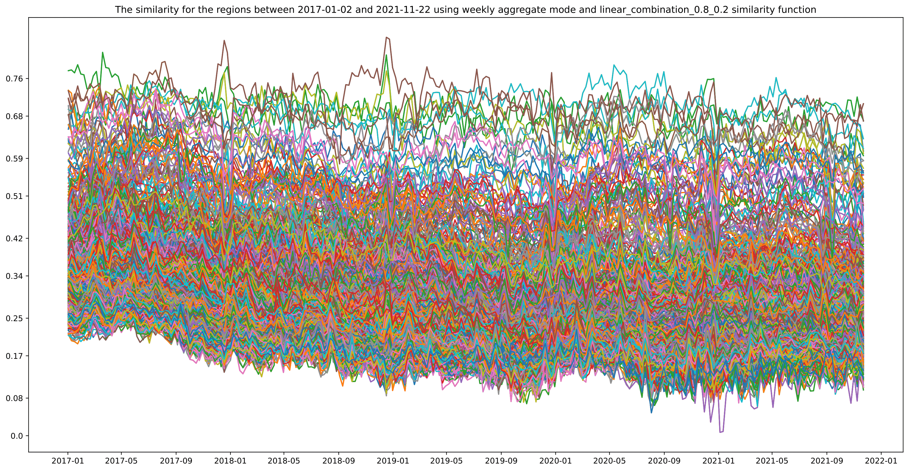
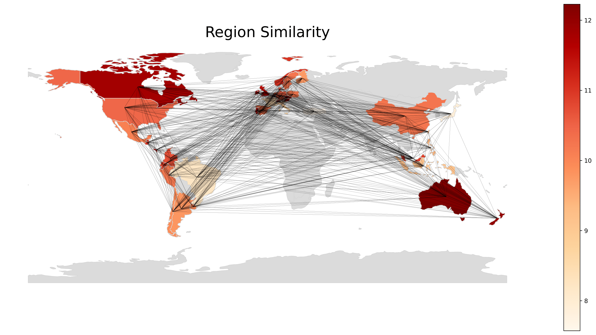
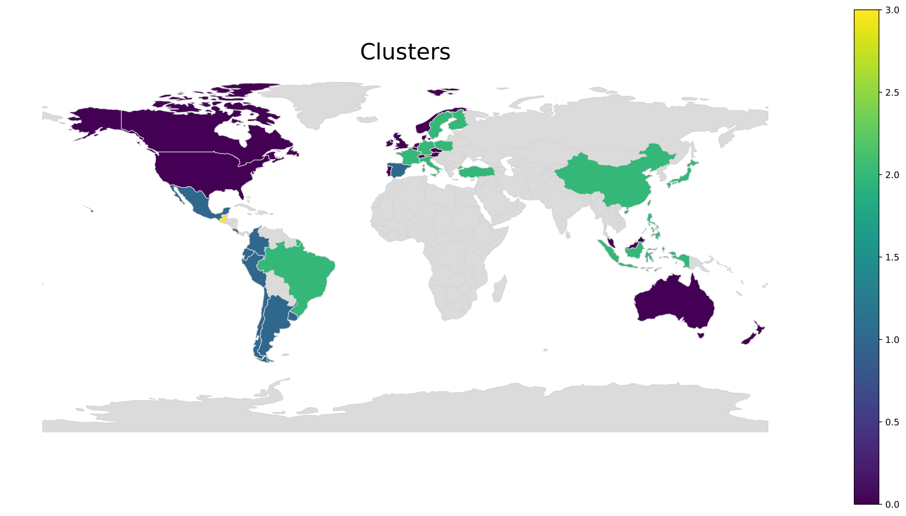

# Appendix

Welcome to the _Appendix_ section of our work. In this section, you will find additional resources, images, and detailed explanations that complement the main content of our analysis.

## Purpose of the Appendix

The materials included in this appendix aim to provide supplementary information, visual aids, and in-depth insights to enhance the understanding of the Spotify dataset and the main ideas discussed in our paper. Whether you are seeking further clarification, additional context, or visual representations, you will find valuable content within this section.

## Contents

1. **Images:** Explore a collection of visual materials, charts, and diagrams that support the findings and conclusions presented in the primary research document.

2. **Explanations:** Dive deeper into specific topics with detailed explanations, annotations, and extended discussions that go beyond the scope of the main text.

### Word Cloud

  

This is a wordcloud showing the names of the most streamed songs globally between 2017 and 2021. The size of the word is proportional to the total number of streams of the song. At first glance, the most popular songs include "Blinding Lights" by The Weeknd, "Dance Monkey" by Tones and I, "Shape of You" by Ed Sheeran, and "Someone You Loved" by Lewis Capaldi. 

[Reproduction code](..\exp\data_audio_features.ipynb "audio features notebook")

### World Map

  

This is a world map showing the number of data points (days) coming from each country. The darker the color, the more data points are coming from that country. The map shows that the majority of the data points are coming from North and South America, Europe, and Australia. 

[Reproduction code](..\exp\data_audio_features.ipynb "audio features notebook")

### Correlation Between Audio Features

  

This is a correlation matrix constructed using Pearson's correlation coefficient, showing the correlation between different audio features. The correlation matrix reveals a robust positive correlation between danceability and energy. Additionally, there is a somewhat weaker correlation observed between valence and energy, as well as between danceability and valence. On the other hand, there is a strong negative correlation between energy and acousticness.

[Reproduction code](..\exp\data_audio_features.ipynb "audio features notebook")

### Daily Average Energy in Turkey and Germany

  

This is a line chart showing the daily average energy of songs streamed in Turkey and Germany between 2017 and 2021. The daily average energy is calculated by taking the average of the energy values of all songs streamed on a given day. The chart shows that, on average, the daily energy of streamed songs in Germany remains consistently higher than that in Turkey, except during Christmas when there is a noticeable drop in the daily average energy of songs listened to in Germany.

[Reproduction code](..\exp\data_audio_features.ipynb "audio features notebook")

### Number of Unique Songs per Rank

  

This graph illustrates the count of distinct songs per rank within the Top 200 across different years in Germany. The chart highlights a notable fluctuation in unique song numbers within the top ranks (approximately up to 40) and demonstrates a consistent rise beyond the 40th rank.

[Reproduction code](..\exp\exp\data_rank_analysis.ipynb "rank analysis notebook")

### Similarities of "Top 200" Playlists Between All Countries

  

This plot displays the similarity of the "Top 200" playlists between all countries where each colored line is the similarity between two countries. The similarity is calculated by a custom index that takes into account the number of shared songs between two playlists and the rank of the shared songs. The calculations can be found [here](..\source\utils\distance_functions.py "regional similarity visualization notebook"). The legend is not shown as the plot is intended to show the general shape and not the individual lines.

[Reproduction code](..\exp\regional_similarity_visualization.ipynb "regional similarity visualization notebook")

### Region Similarity Heatmap with Lines

  

Each value of the heatmap in this plot represents the sum of similarities between that country and all other countries. In a sense, it measures how similar a country is to all other countries. It is seen that New Zealand, Australia, and Canada are the most similar countries to all other countries. 
The thickness of the lines between the countries represents the similarity value with thicker lines showing higher similarity between the two countries.

[Reproduction code](..\exp\regional_similarity_visualization.ipynb "regional similarity visualization notebook")

### Region Similarity Clusters

  

This is a cluster map with 4 clusters using K-Means clustering using the pair-wise distances from the previous plot.

[Reproduction code](..\exp\regional_similarity_visualization.ipynb "regional similarity visualization notebook")